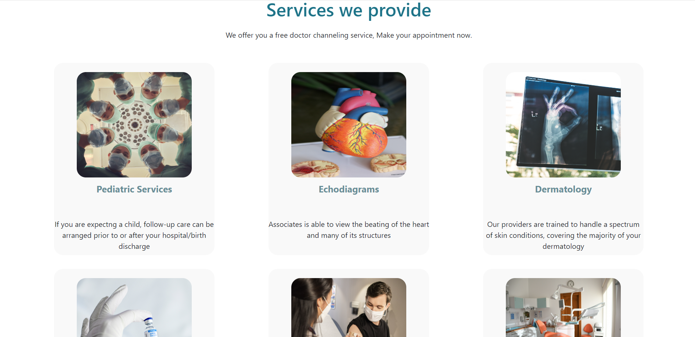
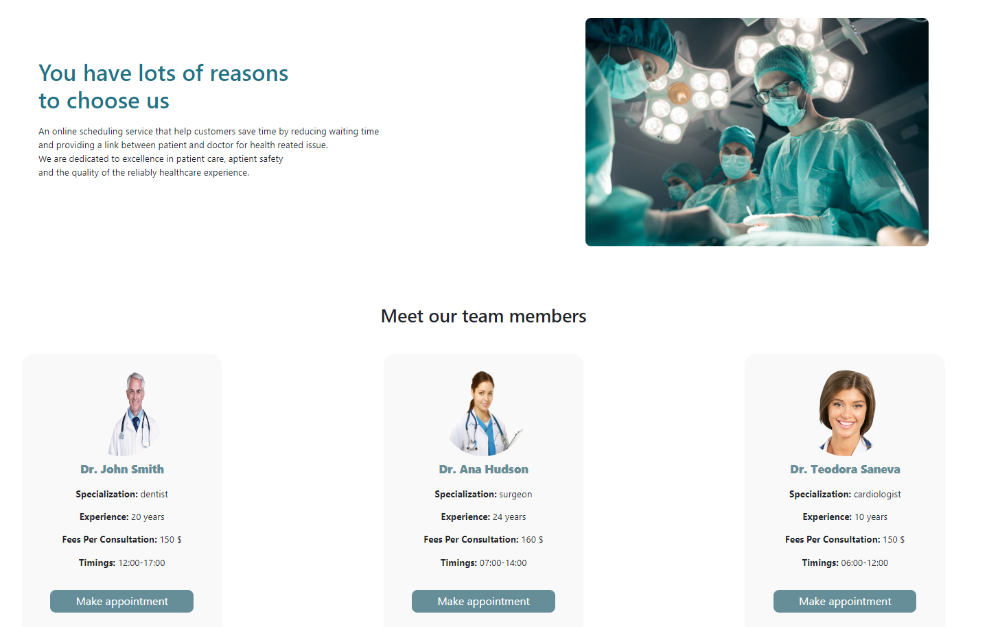
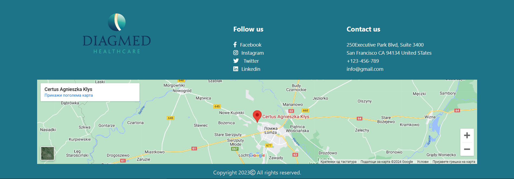
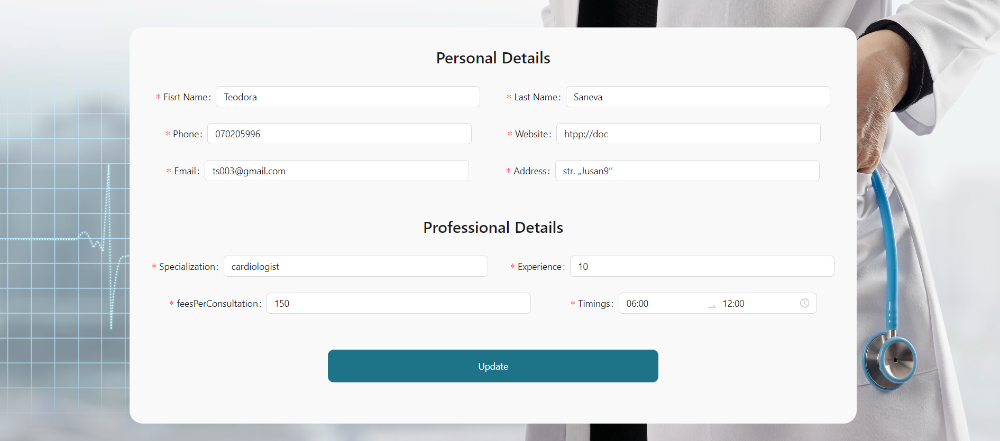
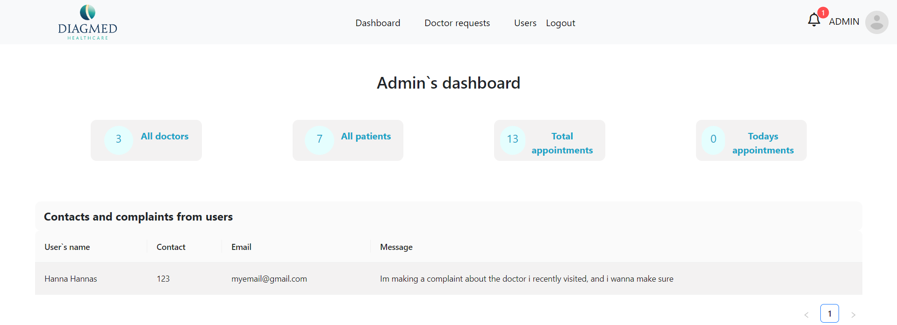
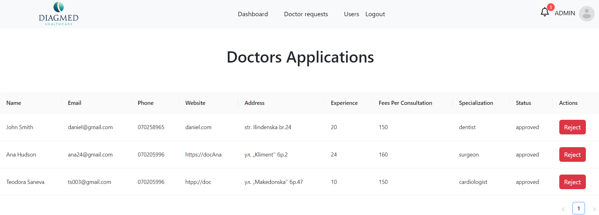

# 🏥 Medical Appointment System

Welcome to the **Medical Appointment System**, a comprehensive MERN stack application designed to streamline healthcare services for patients and providers.

---

## 🚀 Features


| Feature                 | Description                                                       |
|-------------------------|-------------------------------------------------------------------|
| Doctor Page        |Accept,reject appointments, see upcoming appointments and view of montly, weekly and daily schedule              |
| Appointment Booking     | Schedule appointments with preferred doctors based on availability.|
| Profile Management      | Manage and update personal profiles                      |

##Installation
To run the project locally, follow these steps:
1. Clone the repository:
   ```bash
   git clone https://github.com/sanevat/doctor_appointment_system.git
   ```

2. Navigate to the project directory:
   ```bash
   cd doctor_appointment_system
   ```

3. Install dependencies:
   ```bash
   npm install
   ```

4. Set up environment variables:
   - Create a `.env` file in the root directory.
   - Define environment variables such as database connection strings, API keys, cloudinary.


## Screenshots

### Login Page

### Home Page






### Appointment Booking

### Doctors Page





### Admin Page


